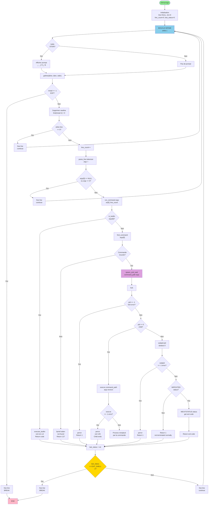

# Simple Shell - Flowchart Complet

```mermaid
graph TD
    Start([Démarrage]) --> Init["Initialisation<br/>line=NULL, len=0<br/>line_count=0, last_status=0"]
    Init --> Loop["BOUCLE INFINIE<br/>while 1"]
    
    Loop --> TTY{"isatty<br/>STDIN?"}
    TTY -->|Oui| Prompt["Afficher prompt<br/>-_- _(ツ)_/ $"]
    TTY -->|Non| Skip["Pas de prompt"]
    
    Prompt --> Read["getline(&line, &len, stdin)"]
    Skip --> Read
    
    Read --> CheckEOF{"nread == -1<br/>EOF?"}
    CheckEOF -->|Oui| FreeExit["free line<br/>BREAK"]
    CheckEOF -->|Non| RemoveNewline["Supprimer newline<br/>line[nread-1] = 0"]
    
    RemoveNewline --> CheckEmpty{"strlen line<br/>== 0?"}
    CheckEmpty -->|Oui| ContinueLoop["free line<br/>continue"]
    CheckEmpty -->|Non| Count["line_count++"]
    
    ContinueLoop --> Loop
    Count --> Parse["parse_line tokenizer<br/>argc = "]
    
    Parse --> CheckArgv0{"argv[0] == NULL<br/>ou argc == 0?"}
    CheckArgv0 -->|Oui| FreeContinue["free line<br/>continue"]
    CheckArgv0 -->|Non| RunCmd["run_command argv<br/>av[0], line_count"]
    
    FreeContinue --> Loop
    
    RunCmd --> CheckBuiltin{"is_builtin<br/>argv[0]?"}
    
    CheckBuiltin -->|Oui| ExecBuilt["execute_builtin<br/>exit env cd<br/>Return code"]
    CheckBuiltin -->|Non| Find["find_command<br/>argv[0]"]
    
    Find --> FoundCmd{"Commande<br/>trouvée?"}
    FoundCmd -->|Non| Error127["fprintf stderr<br/>not found<br/>Return 127"]
    FoundCmd -->|Oui| Spawn["spawn_and_wait<br/>command_path argv"]
    
    Spawn --> Fork["fork"]
    Fork --> CheckPID{"pid == -1<br/>fork error?"}
    CheckPID -->|Oui| ErrorFork["perror<br/>Return 1"]
    CheckPID -->|Non| CheckChild{"pid == 0<br/>child?"}
    
    CheckChild -->|Oui| ExecveChild["execve command_path<br/>argv environ"]
    CheckChild -->|Non| WaitParent["waitpid pid<br/>&status 0"]
    
    ExecveChild --> CheckExecve{"execve<br/>== -1 error?"}
    CheckExecve -->|Oui| ErrorExecve["perror<br/>exit 126<br/>Child ends"]
    CheckExecve -->|Non| ProcessReplaced["Process remplacé<br/>par la commande"]
    
    WaitParent --> CheckWait{"waitpid<br/>== -1 error?"}
    CheckWait -->|Oui| ErrorWait["perror<br/>Return 1"]
    CheckWait -->|Non| CheckWIFEXITED{"WIFEXITED<br/>status?"}
    
    CheckWIFEXITED -->|Non| ReturnFail["Return 1<br/>not terminated normally"]
    CheckWIFEXITED -->|Oui| GetStatus["WEXITSTATUS status<br/>get exit code"]
    
    GetStatus --> ReturnStatus["Return exit code"]
    
    ExecBuilt --> SaveStatus["last_status = ret"]
    Error127 --> SaveStatus
    ErrorFork --> SaveStatus
    ErrorExecve --> SaveStatus
    ErrorWait --> SaveStatus
    ReturnFail --> SaveStatus
    ReturnStatus --> SaveStatus
    
    SaveStatus --> CheckExitShell{"last_status<br/>== EXIT_SHELL<br/>-2?"}
    
    CheckExitShell -->|Oui| FreeExitShell["free line<br/>BREAK"]
    CheckExitShell -->|Non| FreeLoop["free line<br/>continue"]
    
    FreeLoop --> Loop
    
    FreeExit --> EndShell["END"]
    FreeExitShell --> EndShell
    
    style Start fill:#90EE90
    style EndShell fill:#FFB6C6
    style Loop fill:#87CEEB
    style Spawn fill:#DDA0DD
    style CheckExitShell fill:#FFD700
```

